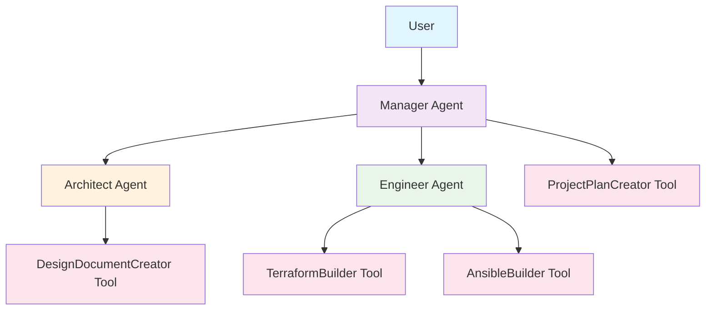
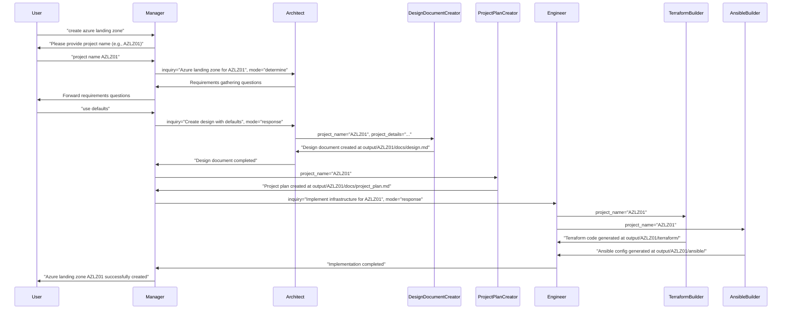
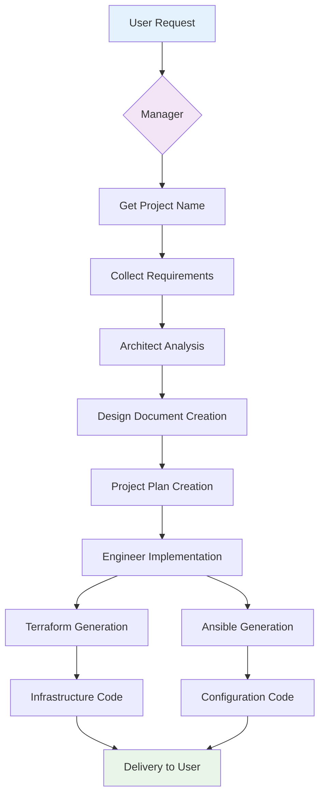

# Cloud Infrastructure Provider

A comprehensive multi-agent system for designing, planning, and implementing cloud infrastructure using Infrastructure as Code (IaC) and configuration management tools.

## Overview

The Cloud Infrastructure Provider is a sophisticated workflow orchestration system that automates the complete lifecycle of cloud infrastructure projects. It uses a collaborative agent architecture where specialized agents handle different aspects of the infrastructure delivery process.

## Architecture

### Agent Hierarchy



### Complete Workflow Diagram



## Agents and Tools

### 1. Manager Agent
**Role**: Project coordinator and user interface
**Responsibilities**:
- **Primary user interaction point**
- **Project name collection and validation**
- **Workflow orchestration**
- **Progress tracking and communication**

**Key Features**:
- Asks for project name first (format: LZ01, AWSLZ01, GCLZ01, etc.)
- Maintains consistent project naming throughout workflow
- Delegates tasks to appropriate specialists
- Provides status updates to users

### 2. Architect Agent
**Role**: Infrastructure design specialist
**Responsibilities**:
- **Requirements gathering and analysis**
- **Architecture design following Well-Architected Framework**
- **Design document creation**

**Design Principles**:
- Operational Excellence
- Security
- Reliability  
- Performance Efficiency
- Cost Optimization

### 3. Engineer Agent
**Role**: Infrastructure implementation specialist
**Responsibilities**:
- **Infrastructure as Code (IaC) generation**
- **Configuration management setup**
- **Implementation coordination**

**Technical Focus**:
- Terraform for infrastructure provisioning
- Ansible for configuration management
- Best practices implementation

### 4. Coded Tools

#### DesignDocumentCreator
```python
class DesignDocumentCreator(CodedTool):
    """Creates detailed infrastructure design documents"""
    
    def invoke(self, args: Dict[str, Any], sly_data: Dict[str, Any]) -> str:
        project_name = args.get("project_name")
        project_details = args.get("project_details", "")
        
        # Creates: output/{project_name}/docs/design.md
```

#### ProjectPlanCreator
```python
class ProjectPlanCreator(CodedTool):
    """Creates project implementation plans with timelines"""
    
    def invoke(self, args: Dict[str, Any], sly_data: Dict[str, Any]) -> str:
        project_name = args.get("project_name")
        
        # Reads: output/{project_name}/docs/design.md
        # Creates: output/{project_name}/docs/project_plan.md
```

#### TerraformBuilder
```python
class TerraformBuilder(CodedTool):
    """Generates Terraform infrastructure code"""
    
    def invoke(self, args: Dict[str, Any], sly_data: Dict[str, Any]) -> str:
        project_name = args.get("project_name")
        
        # Reads: output/{project_name}/docs/design.md
        # Creates: output/{project_name}/terraform/
```

#### AnsibleBuilder
```python
class AnsibleBuilder(CodedTool):
    """Generates Ansible configuration code"""
    
    def invoke(self, args: Dict[str, Any], sly_data: Dict[str, Any]) -> str:
        project_name = args.get("project_name")
        
        # Reads: output/{project_name}/docs/design.md
        # Creates: output/{project_name}/ansible/
```

## File Structure

### Output Organization
```
output/
└── {PROJECT_NAME}/
    ├── docs/
    │   ├── design.md           # Architecture design document
    │   └── project_plan.md     # Implementation timeline
    ├── terraform/              # Infrastructure as Code
    │   ├── main.tf
    │   ├── variables.tf
    │   ├── outputs.tf
    │   └── modules/
    └── ansible/                # Configuration management
        ├── playbook.yml
        ├── inventory.ini
        └── vars/main.yml
```

### Agent Communication Flow



## Supported Cloud Platforms

### Azure
- **Resource Groups**
- **Virtual Networks (VNet)**
- **Virtual Machines**
- **Storage Accounts**
- **Key Vault**
- **Application Gateway**
- **Log Analytics**

### AWS
- **VPC and Networking**
- **EC2 Instances**
- **S3 Storage**
- **IAM Roles and Policies**
- **CloudWatch**
- **Application Load Balancer**

### Google Cloud Platform (GCP)
- **Projects and VPC**
- **Compute Engine**
- **Cloud Storage**
- **Cloud SQL**
- **IAM and Security**
- **Cloud Monitoring**

## Configuration Management

### Key Features
- **Consistent project naming** across all components
- **Design-driven architecture** - all tools read design documents
- **Modular Terraform configurations**
- **Ansible playbooks for post-deployment configuration**
- **Environment-specific variable management**

### Project Naming Convention
- Format: `{CLOUD}{TYPE}{NUMBER}` (e.g., AZLZ01, AWSLZ02, GCLZ03)
- **AZ**: Azure
- **AWS**: Amazon Web Services  
- **GC**: Google Cloud
- **LZ**: Landing Zone

## Usage Examples

### Basic Azure Landing Zone
```bash
User: "create azure landing zone"
System: "Please provide project name (e.g., AZLZ01)"
User: "project name AZLZ01"
System: "Would you like to specify requirements or use defaults?"
User: "use defaults"
```

### AWS Multi-Environment Setup
```bash
User: "create aws infrastructure"
System: "Please provide project name (e.g., AWSLZ01)"
User: "project name AWSAPP01"
System: [Requirements gathering...]
User: [Provide specific requirements]
```

### Google Cloud Landing Zone
```bash
User: "create google landing zone"
System: "Please provide project name (e.g., GCLZ01)"
User: "project name GCLZ01"
System: [Architecture questions...]
User: "proceed with enterprise defaults"
```

## Error Handling and Validation

### Project Name Validation
- **Format checking**: Ensures proper naming convention
- **Uniqueness verification**: Prevents directory conflicts
- **Consistency enforcement**: Same name used throughout workflow

### Design Validation
- **Well-Architected Framework compliance**
- **Security best practices verification**
- **Resource dependency checking**

### Implementation Validation
- **Terraform syntax validation**
- **Ansible playbook testing**
- **Resource naming consistency**

## Best Practices

### 1. Project Organization
- Use consistent naming conventions
- Organize files by environment and purpose
- Maintain clear documentation

### 2. Security
- Follow principle of least privilege
- Implement network segmentation
- Enable monitoring and logging

### 3. Cost Optimization
- Use appropriate resource sizing
- Implement auto-scaling where applicable
- Regular cost review and optimization

### 4. Operational Excellence
- Automate deployment processes
- Implement monitoring and alerting
- Maintain disaster recovery procedures

## Troubleshooting

### Common Issues

#### Project Name Inconsistency
**Problem**: Different agents using different project names
**Solution**: Manager now enforces consistent naming from user input

#### Missing Design Documents
**Problem**: Tools cannot find design.md
**Solution**: All tools now check for design document existence and create directories as needed

#### File Access Issues
**Problem**: Permission errors when creating files
**Solution**: Implement proper error handling and directory creation

### Debug Mode
Enable verbose logging in HOCON configuration:
```hocon
"llm_config": {
    "model_name": "gpt-4o",
    "verbose": true
}
```

## Contributing

### Adding New Cloud Providers
1. Update architecture patterns in design templates
2. Add provider-specific Terraform modules
3. Create corresponding Ansible roles
4. Update documentation and examples

### Extending Agent Capabilities
1. Define new agent responsibilities
2. Implement coded tool interfaces
3. Update HOCON configuration
4. Add comprehensive testing

## Changelog

### Version 2.0
- **Fixed project naming consistency**
- **Implemented user-driven project name collection**
- **Enhanced design-driven architecture**
- **Improved error handling and validation**

### Version 1.0
- **Initial multi-agent architecture**
- **Basic Azure, AWS, GCP support**
- **Terraform and Ansible integration**
- **AAOSA framework implementation**

## License

Copyright (C) 2023-2025 Cognizant Digital Business, Evolutionary AI.
All Rights Reserved.
Issued under the Academic Public License.
